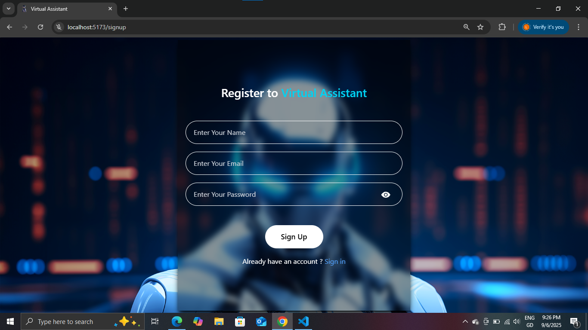
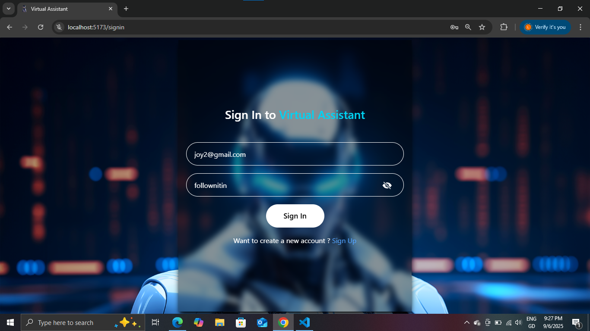
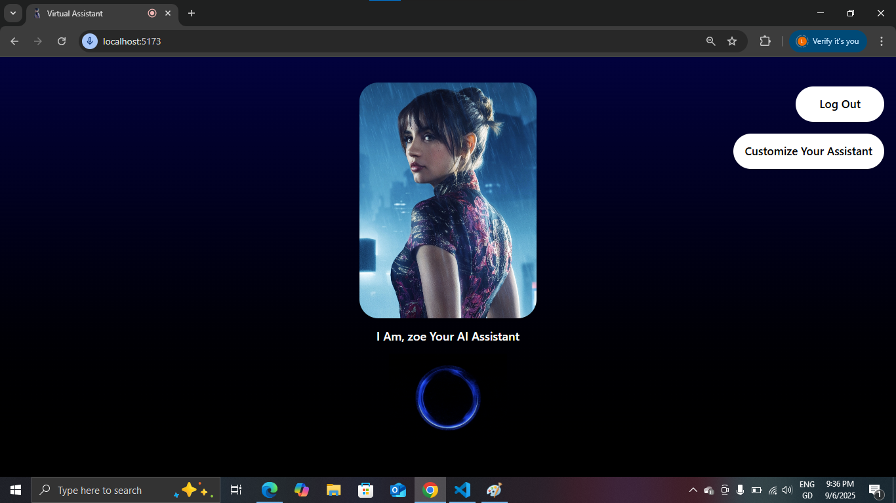
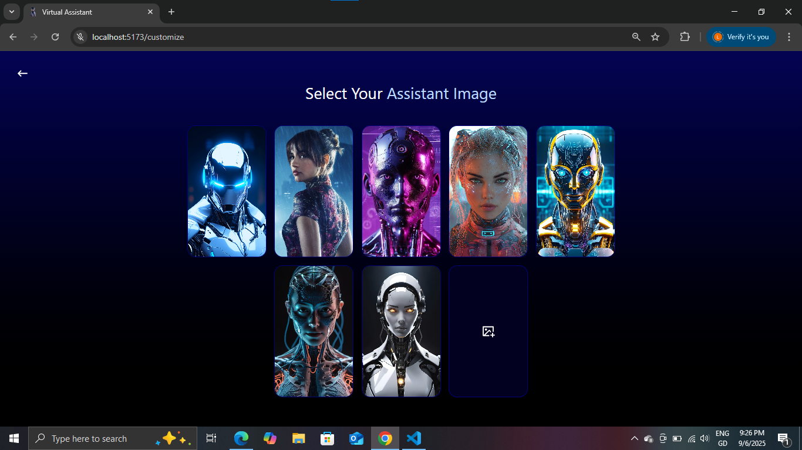

# Virtual Assistant

## 🚀 Live Project  
👉 [virtual-assistant-4p9n.onrender.com](https://virtual-assistant-4p9n.onrender.com)
---

A full-stack AI-powered virtual assistant web application built with React (frontend) and Node.js/Express (backend). Users can register, customize their assistant's name and image, and interact with the assistant via voice commands. The assistant responds with speech and can perform actions like searching Google, playing YouTube videos, and more.

---

## Features

- **User Authentication:** Sign up, sign in, and secure session management.
- **Customizable Assistant:** Choose an assistant image and name.
- **Voice Interaction:** Speak to your assistant and get spoken responses.
- **Smart Commands:** Google search, YouTube search/play, open calculator, Instagram, Facebook, weather, and more.
- **History:** View your previous commands.
- **Persistent User Data:** User and assistant settings are saved in MongoDB.
- **Cloudinary Integration:** Upload and store assistant images.

---

## 🖼️ Screenshots  

### Signup Page  


### Signin Page 


### Homepage  


### Customize Page 



---
## Project Structure

```
backend/
  controllers/
  middlewares/
  models/
  routes/
  config/
  public/
  .env
  index.js
  package.json
frontend/
  src/
    assets/
    components/
    context/
    pages/
    App.jsx
    main.jsx
    index.css
  public/
  index.html
  package.json
```

---

## Getting Started

### Prerequisites

- Node.js (v18+ recommended)
- npm
- MongoDB Atlas account (or local MongoDB)
- Cloudinary account (for image uploads)
- Google Gemini API key

### 1. Clone the Repository

```sh
git clone https://github.com/yourusername/virtual-Assistant.git
cd virtual-Assistant
```

### 2. Backend Setup

1. Go to the backend folder:
   ```sh
   cd backend
   ```
2. Install dependencies:
   ```sh
   npm install
   ```
3. Create a `.env` file (see `.env` example below) and fill in your credentials:
   ```
   PORT=8000
   MONGODB_URL=your_mongodb_connection_string
   JWT_SECRET=your_jwt_secret
   CLOUDINARY_CLOUD_NAME=your_cloudinary_name
   CLOUDINARY_API_KEY=your_cloudinary_api_key
   CLOUDINARY_API_SECRET=your_cloudinary_api_secret
   GEMINI_API_URL=your_gemini_api_url_with_key
   ```
4. Start the backend server:
   ```sh
   npm run dev
   ```

### 3. Frontend Setup

1. Go to the frontend folder:
   ```sh
   cd ../frontend
   ```
2. Install dependencies:
   ```sh
   npm install
   ```
3. Start the frontend development server:
   ```sh
   npm run dev
   ```
4. Open [http://localhost:5173](http://localhost:5173) in your browser.

---

## Usage

1. **Register:** Create a new account.
2. **Customize:** Choose your assistant's image and name.
3. **Interact:** Speak to your assistant and receive spoken responses.
4. **History:** View your previous commands and interactions.

---

## Technologies Used

- **Frontend:** React, React Router, Tailwind CSS, Axios, React Icons
- **Backend:** Node.js, Express, MongoDB, Mongoose, JWT, Cloudinary, Multer, Gemini API
- **Other:** SpeechRecognition API, SpeechSynthesis API

---

## Environment Variables

See [`backend/.env`](backend/.env) for backend configuration.

---

## License

This project is for educational purposes.

---

## Author

- [Nitin Pandey](https://github.com/nitinbutnvm)